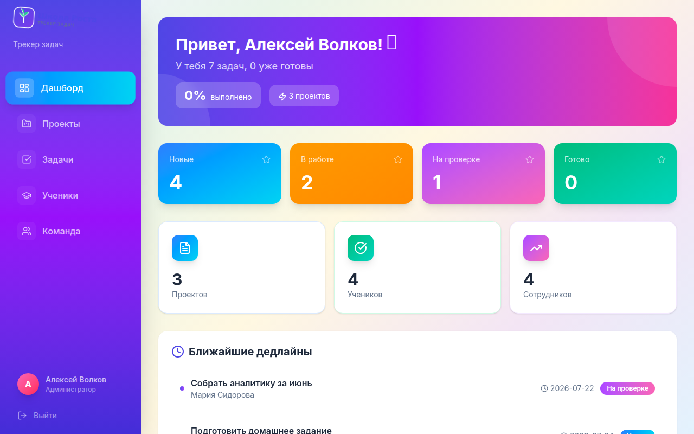
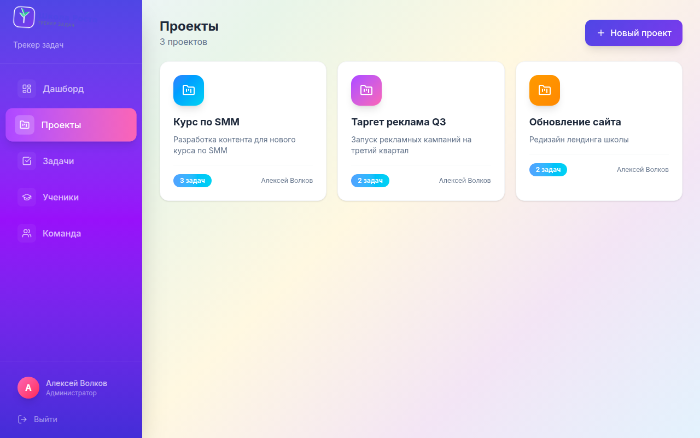
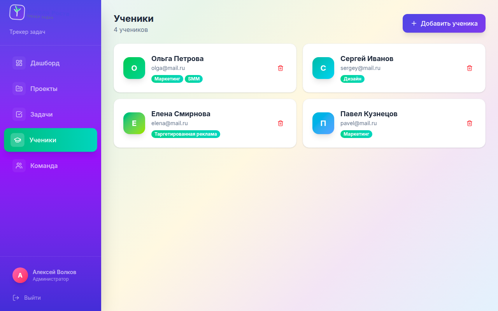

# Школа Роста — Трекер задач

Веб-приложение для управления задачами онлайн-школы. Заменяет разрозненные Telegram, Google Таблицы и Notion единым инструментом.

**[Демо-доступ](https://shkolarosta.duckdns.org)** — admin@shkolarosta.ru / admin123

---

## Задача клиента

Онлайн-школа «Школа Роста» (500+ учеников, 12 курсов, команда из 8 человек). Всё разрознено: задачи — в Telegram, домашки — в Google Таблицах, договоры — в почте. Сотрудники пропускают дедлайны, руководитель не видит кто чем занят.

**Нужен:** единый инструмент, где задачи, ученики, дедлайны и комментарии — вместе.

---

## Что реализовано

| Возможность | Описание |
|---|---|
| **Дашборд** | Статистика по задачам, ближайшие дедлайны, последние обновления |
| **Проекты** | Создание и управление проектами (курсы, маркетинг, операционка) |
| **Задачи** | CRUD с фильтрами по статусу, исполнителю, проекту, дедлайну |
| **Статусы** | Новая → В работе → На проверке → Готово |
| **Комментарии** | Обсуждение задач в карточке |
| **Ученики** | Список учеников, привязка к задачам |
| **Сотрудники** | Управление командой (только для администратора) |
| **Авторизация** | JWT-токены, роли (админ / сотрудник) |
| **Адаптивный дизайн** | Работает на мобильных и десктопе |

---

## Результат

- Единое пространство для команды из 8 человек
- Видимость всех задач и дедлайнов в одном месте
- Сохранение истории обсуждений в комментариях
- Ролевая модель: администратор управляет, сотрудники работают

---

## Стек

| Слой | Технологии |
|---|---|
| Frontend | React 19, Vite 8, TailwindCSS 4 |
| Backend | Express 5, Node.js |
| База данных | SQLite (sql.js) |
| Авторизация | JWT + bcrypt |
| Деплой | VPS (Timeweb), Nginx, systemd |

---

## Запуск

```bash
# Установка зависимостей
npm install
cd client && npm install && npm run build

# Запуск
npm start
```

---

## Демо-аккаунты

| Роль | Email | Пароль |
|---|---|---|
| Администратор | admin@shkolarosta.ru | admin123 |
| Сотрудник | maria@shkolarosta.ru | pass123 |

---

## Скриншоты




